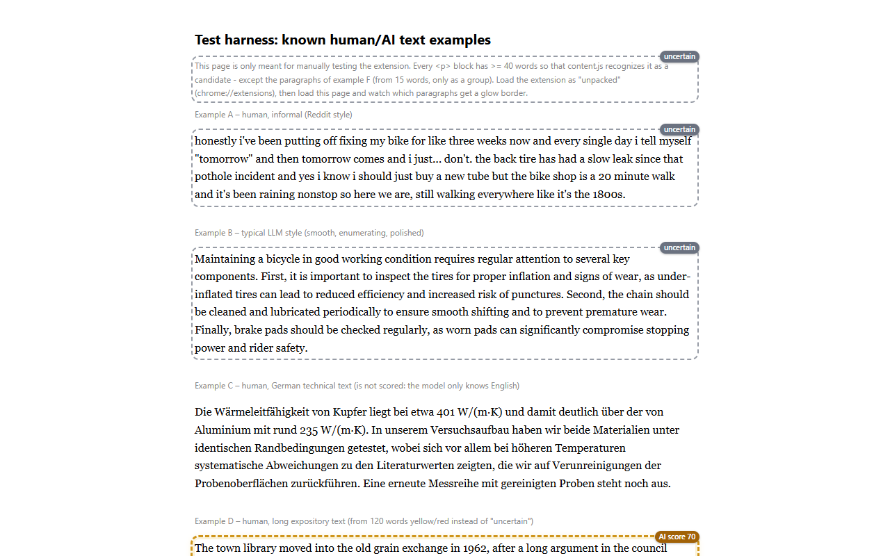

# AI Content Flag

**Browser extension that checks paragraphs of text on web pages for signs of AI – right in your
browser, without your texts ever leaving your computer.**

Longer paragraphs are scored with an AI-text classifier and marked with a traffic light:

| Marker | Meaning |
|---|---|
| 🟢 green, thin border | not flagged – checked, not detected as AI |
| 🟡 yellow, dashed | unclear |
| 🔴 red, heavy border | flagged – resembles AI text |
| ⚪ gray, "uncertain" | too short for a reliable verdict |

Plus an AI score from 0–100. The borders are distinguishable even without color perception.

> [!IMPORTANT]
> **A hint, not proof.** The score is not a probability. Texts written by humans are also
> sometimes marked red – especially short, translated or heavily edited ones. Please do not
> accuse anyone of using AI based on this marker alone.

---

## 🔒 Privacy

The extension was built from the start so that you do not have to give anything away:

- **Runs locally.** By default the model works directly in the browser (WebAssembly). Texts you
  read are not sent anywhere. The only outgoing connection is the **one-time download of the
  model** from Hugging Face – no page content is transmitted in the process.
- **No tracking.** No usage statistics, no ads, no analytics services, no account,
  no sharing with third parties.
- **Only where you allow it.** By default, only pages that you approve yourself are scanned.
  Without approval, the extension does not read any text there.
- **Sensitive sites are off limits.** Online banking, webmail, payment services and government
  portals (around 14,000 domains) are never scanned automatically. The list is built in and is
  not reloaded from the network – nobody learns which sites you visit. In addition, the
  extension pauses on every page with a password, credit card or one-time code field (the
  content of such fields is never read).
- **Only the bare minimum is stored – and only on your machine.** The extension remembers
  paragraphs it has already scored as a fingerprint (hash) with score – **without text and
  without address**, for 30 days by default, deletable at any time or completely switchable off.
- **Feedback only with consent.** If you state where a text comes from, this is only stored
  after your explicit consent – locally, without address, and never transmitted.
- **One switch for everything:** `Alt+Shift+A` stops all processing.
- **Open source.** Every line of code can be verified here in the repository.

**Optionally**, instead of the browser model you can use your own server, a cloud service or
the Hugging Face Inference API. Only then are paragraphs (up to 2000 characters) sent to that
service – the settings show this clearly before anything is sent.

Full privacy policy: [`extension/privacy.html`](extension/privacy.html) (also linked in
the extension's settings).

---

## 📦 Installation

The extension is offered only here via GitHub, not via the Chrome Web Store. It runs in
**Chrome, Edge, Brave and other Chromium browsers**.

1. **Download:** Under [Releases](https://github.com/OJPOJ/ai-check-extension/releases/latest)
   download the file `ai-content-flag-<version>.zip`.
2. **Unzip** into a folder you will keep (e.g. `Documents\AI Content Flag`).
   Do not delete it – the browser loads the extension from this folder.
3. **Open the extensions page:** enter `chrome://extensions` (Edge: `edge://extensions`) in the
   address bar.
4. Turn on **Developer mode** (switch at the top right, in Edge at the bottom left).
5. Click **"Load unpacked"** and select the unzipped folder (the folder that contains the
   file `manifest.json`).
6. Optional: **pin** the extension via the puzzle icon in the toolbar.

Afterwards a welcome page and the settings open.

> [!NOTE]
> Because the extension does not come from a store, the browser shows the words "Developer mode"
> and does **not update it automatically**. This is normal for installations from GitHub.

### Download the model (one time)

In the settings, choose a model and click **"Download"**. It is loaded once from
Hugging Face (no account, no token needed) and then stays stored in the browser.

| Model | Download | What for |
|---|---|---|
| **Accurate** (desklib) – default | 1.7 GB, reduced to ~475 MB in the browser | best accuracy, fewest false alarms, ~1 s per paragraph |
| **Balanced** (fakespot) | 125 MB | good compromise |
| **Fast** (TMR) | 126 MB | very fast, but significantly more false alarms |

Tip: With a slow connection or little disk space, start with "Balanced".

### Updating

1. Download the new zip file from the [Releases](https://github.com/OJPOJ/ai-check-extension/releases).
2. Replace the contents of the **previous folder** with the new ones (same folder!).
3. Under `chrome://extensions`, click the reload arrow ↻ on AI Content Flag.

Settings, the downloaded model and stored scores are kept as long as
the folder stays the same. Anyone who removes the extension and reloads it from a different folder
starts from scratch.

---

## 🚀 Usage

**Approve a page:** On a web page, click the extension icon and turn on the
switch "Scan this site automatically". From then on the page is checked when you visit it. Alternatively,
"Scan page now" once.

**Check a single passage:** Select text → right-click → "Check selected text for AI"
(or `Alt+Shift+C`). Without a selection: right-click a paragraph → "Check this paragraph for
AI". This works everywhere, even on pages that have not been approved.

**View details:** Click the score badge of a marked paragraph.

**Keyboard shortcuts**

| Shortcut | Action |
|---|---|
| `Alt+Shift+A` | extension on / off |
| `Alt+Shift+S` | scan the current page now |
| `Alt+Shift+C` | check selected text |

Changeable under `chrome://extensions/shortcuts`.

**Scan mode** (in the settings): *only on button press*, *on selected sites*
(default) or *on all sites*. The blocklist for sensitive sites applies in every mode;
your own entries and exceptions can be set in the settings or via "Never scan here" in the
popup.

---

## ⚠️ Limitations

- **English only.** The models are trained exclusively on English texts. Paragraphs in
  other languages are detected and deliberately **not scored** (the count is shown in the popup).
  They can still be checked via right-click, but the result is then always "uncertain".
- **False alarms happen.** With the default model, in tests about 1 in 100 human
  paragraphs was wrongly marked red, with "Fast" significantly more.
- **Short texts** under about 120 words are usually marked "uncertain" instead of in color, because
  the model is wrong too often there.
- **Not reached** are contents in iframes and in the Shadow DOM.
- Newer or deliberately reworded AI texts can go undetected.

---

## ❓ FAQ

**Why not in the Chrome Web Store?**
The extension is deliberately distributed directly as an open-source project. The code you
install is exactly the code in this repository.

**Is Developer mode dangerous?**
It only allows loading extensions from a folder. Install extensions this way only
from sources you trust – with this project you can check the source code yourself.

**How do I get rid of the extension and all data again?**
Click "Remove" under `chrome://extensions`. The browser deletes all locally
stored data of the extension, including the model. Afterwards you can delete the folder.

**Can I use my own model or my own server?**
Yes – see [`DEVELOPMENT.md`](DEVELOPMENT.md) and [`server/README.md`](server/README.md).

---

## 💬 Feedback

Please report false alarms or problems as an [issue](https://github.com/OJPOJ/ai-check-extension/issues).

---

## 🛠️ For developers

Build, tests, architecture and measurement results: [`DEVELOPMENT.md`](DEVELOPMENT.md).
Open items: [`TODO.md`](TODO.md).

## License

The code is under the [MIT license](LICENSE). Excluded are the bundled blocklist
(`extension/generated/blocklist.js`) and the reference set (`extension/bg/reference-set.js`), which
are under CC BY-SA 4.0. Sources and licenses of all third-party components:
[`extension/THIRD_PARTY_NOTICES.md`](extension/THIRD_PARTY_NOTICES.md).
